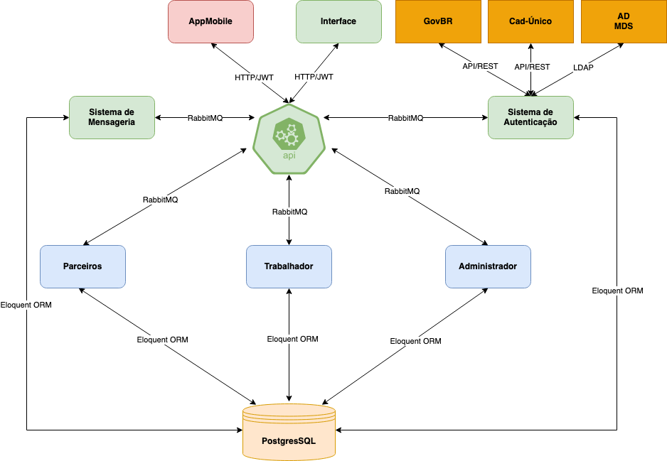

# Sistema do Programa Redução da Pobreza - SISPRP

## Descrição do Projeto
<p align="justify">O projeto SISPRP visa primordialmente atender às necessidades daqueles inscritos no cadastro único, estabelecendo uma abordagem proativa para auxiliá-los a desvincular-se das políticas governamentais de combate ao desemprego. Nossa missão é empoderar esses indivíduos, capacitando-os com os conhecimentos e recursos necessários para conquistar uma independência financeira duradoura.</p>
<p>
A iniciativa abraça três pilares fundamentais: a oferta de vagas em cursos de capacitação, a disponibilização de oportunidades de emprego e a facilitação de acesso a microcréditos. O programa é voltado para pessoas em situação de vulnerabilidade social, como beneficiários do Bolsa Família, desempregados, jovens em busca do primeiro emprego, trabalhadores autônomos e microempreendedores individuais (MEIs).</p>

## Arquitetura do Projeto

A imagem a seguir ilustra a arquitetura do projeto.



## Tecnologias Utilizadas
* [PHP](https://www.php.net/)
* [Laravel](https://laravel.com/)
* [PostgreSQL](https://www.postgresql.org/)
* [Docker](https://www.docker.com/)
* [Docker Compose](https://docs.docker.com/compose/)
* [React](https://pt-br.reactjs.org/)

## Instalação
### Pré-requisitos
* [Docker](https://www.docker.com/)
* [Docker Compose](https://docs.docker.com/compose/)
* [Git](https://git-scm.com/)

### Clonando o repositório
```bash
$ git clone https://XXX SISPRP
```

### Configurando o ambiente
```bash
$ touch .env
$ cp .env.example .env
``` 

> Edite o arquivo `.env` e configure as variáveis de ambiente de acordo com o seu ambiente.

### Entre na pasta do projeto
```bash
$ cd SISPRP
```

### Clone os repositórios dos demais microserviços
```bash
$ git clone https://XXX FrontEnd
$ git clone https://XXX API
$ git clone https://XXX ADMIN
$ git clone https://XXX TRABALHADOR
$ git clone https://XXX PARCEIROS
$ git clone https://XXX AUTH
$ git clone https://XXX NOTIFICACOES
```

> Entre em cada pasta dos microserviços e siga as instruções de instalação do README.md de cada um.

### Iniciando o ambiente
```bash
$ docker-compose up -d --build
``` 

## Executando o ambiente
 Entre no navegador e acesse os seguintes  endereço:
 
 - [http://localhost:3000](http://localhost:3000) -> FrontEnd
- [http://localhost:8000/swagger](http://localhost:8000/swagger) -> API

## Equipe
* [Diego José Macedo](mailto:diegomacedo@ibict.br)
* [Lucas Rodrigues Costa](mailto:lucasrodrigues@ibict.br)
* [Rebeca dos Santos de Moura](mailto:rebecamoura@ibict.br)
* [Lendro Chaves](mailto:leandrochaves@ibict.br)
* [Rafael Roque](mailto:rafaelroque@ibict.br)
* [Victor Braga](mailto:victorbraga@ibict.br)
* [Vitor Mateus](mailto:vitormateus@ibict.br)
* [Jaqueline Guitierri](mailto:jaquelineguitierri@ibict.br)
